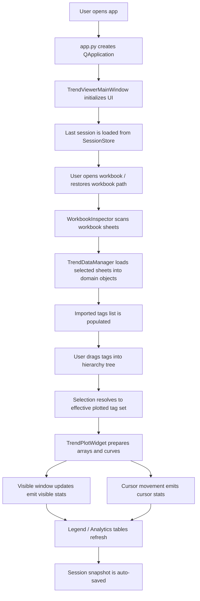
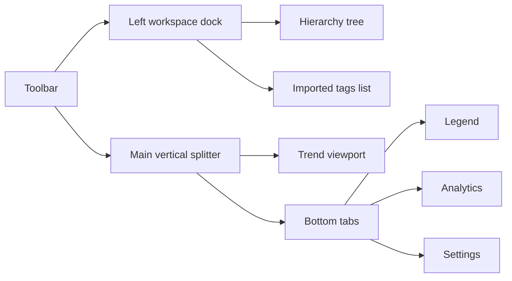
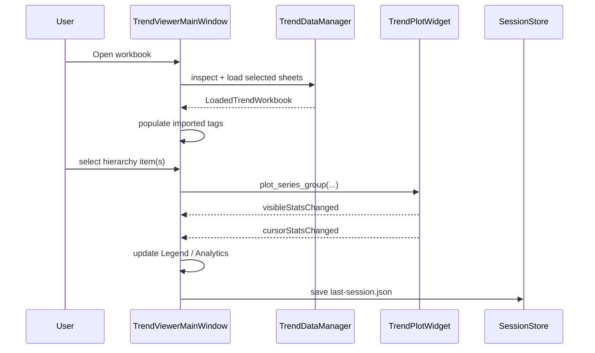

# WTE Trend Viewer Architecture Report

## Purpose

`wte3` is a desktop SCADA-style workbook trend viewer.

Its core job is:

1. Open an Excel workbook.
2. Detect sheets that contain time-series data.
3. Let the user organize tags into a manual hierarchy.
4. Plot one or many tags in a shared time window.
5. Preserve the working state between launches.

The current product direction is intentionally operator-oriented rather than spreadsheet-oriented: the UI is built around trend inspection, grouping, naming, units, cursor reading, detached comparison windows, and session continuity.

## Stack And Why It Exists

| Package / module | Why it is used |
| --- | --- |
| `PySide6` | Main desktop UI toolkit. Handles windows, dialogs, tables, lists, tree widgets, splitters, menus, signals/slots, and application lifecycle. |
| `pyqtgraph` | Fast plotting layer on top of Qt. Used because it is much lighter and more interactive for dense time-series than trying to draw charts manually with raw Qt widgets. |
| `polars[calamine]` | Workbook ingestion and in-memory tabular handling. `calamine` gives Excel reading, and `polars` provides a compact, efficient columnar model. |
| `numpy` | Numeric arrays and plotting math. Used for visible-window slicing, downsampling, interpolation, normalization, and cursor/sample indexing. |
| `json` / `pathlib` / stdlib dataclasses | Session persistence and structured state transport. |
| `pytest` | Regression suite, including offscreen Qt widget tests. |

## High-Level Structure

```text
src/wte_trend_viewer/
  app.py                     QApplication bootstrap
  session.py                 Session dataclasses + JSON persistence
  workbook.py                Workbook inspection and raw sheet loading
  data_manager.py            Workbook -> trend domain model
  tag_units.py               Unit normalization and display formatting
  ui/
    main_window.py           Main application coordinator and detached windows
    dialogs/
      sheet_selection_dialog.py
      unit_manager_dialog.py
    styles/
      theme.py               Global dark stylesheet
    widgets/
      imported_tag_list.py   Searchable imported-tag source list
      hierarchy_tree.py      Searchable drag/drop hierarchy editor
      trend_plot_widget.py   Plot, cursor, time window, shared-scale logic
```

## Entry Points

- CLI / installed script: `wte-trend-viewer`
- Module run: `python -m wte_trend_viewer`
- Bootstrap: [app.py](/C:/Users/jakob/GIT/wte3/src/wte_trend_viewer/app.py)

Runtime startup is intentionally thin:

1. Create `QApplication`
2. Apply global stylesheet
3. Construct `TrendViewerMainWindow`
4. Show window
5. Enter Qt event loop

## Runtime Flow



## Core Domain Model

### Workbook inspection layer

Primary file: [workbook.py](/C:/Users/jakob/GIT/wte3/src/wte_trend_viewer/workbook.py)

Responsibilities:

- read workbook sheets with `polars.read_excel(..., engine="calamine")`
- detect timestamp columns
- determine which sheets are trend-data sheets
- generate qualified tag names such as `Sheet/Tag` when multiple data sheets exist

Primary types:

- `WorkbookSheetSummary`
- `WorkbookInspectionResult`
- `WorkbookInspector`

This layer is intentionally metadata-oriented. It does not build plot objects. It only answers: "what sheets and tags are available, and which look like time-series data?"

### Loaded trend model

Primary file: [data_manager.py](/C:/Users/jakob/GIT/wte3/src/wte_trend_viewer/data_manager.py)

Responsibilities:

- convert selected workbook sheets into in-memory trend objects
- keep timestamps and value columns together
- provide helper accessors for `series_for_tag(...)` and `sheet_for_tag(...)`
- coerce workbook values into numeric/time forms suitable for plotting

Primary types:

- `TrendSeriesData`
- `TrendSheetData`
- `LoadedTrendWorkbook`
- `TrendDataManager`

Important design choice:

- `TrendSeriesData.plot_points(...)` converts source columns into plain numeric time/value vectors.
- The raw workbook remains conceptually separate from the prepared plotting state.

That separation is useful because workbook parsing is one concern, while plotting/window/cursor behavior is another.

## UI Composition

Primary file: [ui/main_window.py](/C:/Users/jakob/GIT/wte3/src/wte_trend_viewer/ui/main_window.py)

The main window is the coordination layer. It is not a passive view. It owns the current workbook, current session, current preview tag set, current display ranges, color assignments, custom names, units, and detached plot windows.

### Main layout



### Left side

- `SearchableHierarchyTree`
  - manual categories and subcategories
  - drag/drop target for imported tags
  - selecting a group resolves to all descendant tags
- `SearchableImportedTagList`
  - workbook-derived source tag list
  - copy-drag origin into the hierarchy

### Center / top

- `TrendPlotWidget`
  - actual plotting engine
  - shared Y display normalization
  - collapsible time-window and pan controls
  - cursor line
  - configurable floating legend
  - shared-scale decimal precision context menu
  - pop-out-compatible state capture

### Bottom tabs

- `Legend`
  - range editing
  - explicit color assignment
  - highlight toggles
- `Analytics`
  - cursor value
  - visible-window min/max/avg
- `Settings`
  - time preset management

### Detached windows

`_DetachedTrendWindow` is a lightweight second shell around another `TrendPlotWidget`.

It receives a snapshot of:

- plotted series
- display ranges
- display labels
- units
- colors
- highlight state
- time presets
- time selection state
- pan fraction

This is not a separate data model. It is a secondary UI projection of the same current selection at the moment of pop-out.

Detached windows also have their own collapsible details section containing:

- `Legend`
  - current tag label, unit, range, and highlight state
- `Analytics`
  - live cursor and visible-window stats from that detached plot
- `Settings`
  - the currently available time presets

## Plotting And Interaction Model

Primary file: [trend_plot_widget.py](/C:/Users/jakob/GIT/wte3/src/wte_trend_viewer/ui/widgets/trend_plot_widget.py)

This is the most important technical file in the program.

### Main responsibilities

- prepare plot arrays from `TrendPlotSeries`
- normalize each tag to a shared visual `0..100` Y space using per-tag low/high ranges
- render only the visible window
- downsample visible data for responsiveness
- compute visible-window stats
- compute cursor stats
- manage pan fraction and explicit time-window controls
- manage floating-legend display state and placement
- manage shared-scale display precision
- persist its internal UI state into session snapshots

### Internal data types

- `TrendPlotSeries`
  - workbook sheet + series pair used as plot input
- `_PreparedTrendPlotSeries`
  - fully prepared plotting state:
    - display label
    - color
    - low/high display range
    - `numpy` x/y arrays
    - pyqtgraph curve item
- `TrendVisibleSeriesStats`
  - stats for the current visible x-window
- `TrendCursorSeriesStats`
  - per-tag cursor reading and interpolation metadata
- `TrendCursorStats`
  - cursor timestamp + all tag readings

### Shared Y scaling

This application deliberately does not use independent Y axes.

Instead:

1. Each tag has a user-defined `Low Range` and `High Range`.
2. Raw values are normalized into the same `0..100` display band.
3. The left stacked scale panel shows raw low/mid/high numbers per tag.

That gives the operator one visually aligned trend area while preserving per-tag engineering ranges.

This is a strong product choice. It optimizes side-by-side pattern comparison over raw-axis purity.

### X-only interaction

`_TrendViewBox` is a custom `pyqtgraph.ViewBox` used to hard-lock Y motion.

That means:

- dragging pans only in time
- zooming preserves fixed Y range
- explicit Y drift is prevented even if pyqtgraph tries to apply it

This is one of the cleanest engineering choices in the app because it encodes the intended interaction model directly into the view box rather than trying to patch around it at the UI layer.

### Cursor model

The cursor system does two things:

1. show a vertical inspection line
2. compute per-tag values at the current time

Cursor values are built from:

- exact sample if cursor lands on a sample
- linear interpolation between surrounding samples
- nearest-sample fallback if interpolation is impossible

The floating legend and analytics cursor column both now prefer the same cursor-time value logic, which avoids a common bug where different UI surfaces disagree about what "cursor value" means.

The floating legend is explicitly operator-controlled from a plot context menu:

- `Floating legend`
  - show or hide the legend overlay
- `Show data at cursor time`
  - include live per-tag values in the floating legend
- `Follow on Y axis`
  - make the legend track vertically with the cursor instead of staying top-anchored

When top-anchored, the legend flips left/right around the cursor depending on which half of the plot the cursor is in. When Y-follow is enabled, it still keeps a fixed pixel offset below the mouse cursor rather than covering the inspected point.

### Shared-scale panel behavior

The shared-scale panel is not just passive text. It has its own display rules:

- tags are packed into vertical stacks to conserve width
- the panel supports configurable decimal precision
- precision is changed from a right-click context menu in the scale area
- those precision settings are persisted with the plot/session state

### Visible-window stats

The curve renderer uses padded samples just outside the visible window for visual continuity.

The stats path is intentionally separate:

- drawing slice: padded for visual continuity
- statistics slice: exact visible range only

That separation is important and easy to miss. It prevents `Window Min` / `Window Max` from being polluted by an off-screen spike that is only present to keep the line visually continuous.

## Session Model And Persistence

Primary file: [session.py](/C:/Users/jakob/GIT/wte3/src/wte_trend_viewer/session.py)

The program persists session data as JSON, not as ad-hoc UI settings.

`WorkspaceSession` stores:

- `hierarchy`
- `imported_tags`
- `trend_state`
- `legend_state`
- `analytics_state`
- `settings_state`
- `ui_state`

This is a pragmatic architecture choice:

- simple to inspect manually
- easy to version
- easy to test
- no database required

In [ui/main_window.py](/C:/Users/jakob/GIT/wte3/src/wte_trend_viewer/ui/main_window.py), `_capture_session()` and `_apply_session()` act as the serialization/deserialization boundary between live widgets and JSON state.

That persisted state includes more than just workbook and hierarchy data. It also carries operator-facing trend configuration such as:

- selected preview tag set
- display ranges keyed by selected tag set
- tag colors
- highlighted tags
- custom names
- assigned units
- time presets
- active time window
- collapsed/expanded time-control state
- floating-legend settings
- shared-scale decimal precision

The app also stores last-workbook information in a resilient way:

- absolute path if available
- relative path fallback
- workbook-name search fallback

That reduces breakage when the repo or workbook is moved between machines.

## Naming, Units, And Display Identity

Primary files:

- [tag_units.py](/C:/Users/jakob/GIT/wte3/src/wte_trend_viewer/tag_units.py)
- [ui/main_window.py](/C:/Users/jakob/GIT/wte3/src/wte_trend_viewer/ui/main_window.py)
- [ui/widgets/imported_tag_list.py](/C:/Users/jakob/GIT/wte3/src/wte_trend_viewer/ui/widgets/imported_tag_list.py)
- [ui/widgets/hierarchy_tree.py](/C:/Users/jakob/GIT/wte3/src/wte_trend_viewer/ui/widgets/hierarchy_tree.py)

One important architectural decision is that the app preserves the raw tag identifier separately from the displayed label.

That means:

- internal identity remains stable: `Process Data/TAG001`
- displayed label can change: `TAG001 - Example temperature [C]`

This avoids a classic bug where renaming a visible item accidentally changes the application key used for lookup, plotting, or persistence.

Units are normalized without brackets on input, then displayed everywhere as `[UNIT]`. Superscript formatting is applied centrally in `tag_units.py`, not at each widget call site.

That centralization is a good choice because display normalization stays consistent across:

- hierarchy labels
- imported tag list
- legend
- analytics
- plot labels

## State And Event Flow



## Why The Code Looks The Way It Does

### 1. Main window as coordinator instead of strict MVVM/MVC

This codebase is not aggressively layered into view-model classes.

Instead, `TrendViewerMainWindow` acts as a pragmatic coordinator:

- UI assembly
- workbook loading
- session capture/apply
- range/color/highlight state
- detached window spawning

Tradeoff:

- easier to ship and reason about in a small desktop app
- heavier main window file
- some duplicated table-refresh logic unless actively factored

For this size of application, that is a defensible choice.

### 2. Prepared arrays are cached

Plotting uses prepared `numpy` arrays in `_PreparedTrendPlotSeries` rather than recomputing workbook values on every view update.

That is the correct performance move because:

- visible slicing is frequent
- cursor movement is frequent
- interpolation and downsampling are frequent

### 3. Visual behavior is encoded in widget logic, not hidden in table state

Examples:

- `_TrendViewBox` encodes X-only behavior
- shared-range normalization is explicit
- cursor and visible-window stats are emitted as typed dataclasses

This makes behavior easier to test offscreen.

### 4. JSON session snapshots instead of opaque Qt state blobs

The app does use Qt widget state, but it serializes the application meaning instead of trying to save raw widget internals.

That is better for longevity and migration.

## Testing Strategy

Primary files: [tests](/C:/Users/jakob/GIT/wte3/tests)

The suite uses headless Qt via [conftest.py](/C:/Users/jakob/GIT/wte3/tests/conftest.py):

- `QT_QPA_PLATFORM=offscreen`
- shared `QApplication` fixture

Coverage areas include:

- workbook inspection and load behavior
- hierarchy selection rules
- display-range persistence
- units and custom names
- legend color/highlight behavior
- session restore
- detached trend windows
- plot widget cursor, interpolation, scaling, floating legend, and context menus
- shared-scale precision and collapsible plot controls

This is a strong sign that the codebase is becoming refactor-friendly. The most brittle part of any Qt application is usually widget behavior hidden behind event handlers; here, much of that behavior is already exercised directly.

## Important Extension Points

If I were extending this codebase, I would start here:

- [ui/main_window.py](/C:/Users/jakob/GIT/wte3/src/wte_trend_viewer/ui/main_window.py)
  - add high-level workflow features
  - add new tabs, dialogs, and persistence fields
- [ui/widgets/trend_plot_widget.py](/C:/Users/jakob/GIT/wte3/src/wte_trend_viewer/ui/widgets/trend_plot_widget.py)
  - add plot behaviors, cursor tools, export hooks, and comparison tools
- [session.py](/C:/Users/jakob/GIT/wte3/src/wte_trend_viewer/session.py)
  - add versioned session fields
- [data_manager.py](/C:/Users/jakob/GIT/wte3/src/wte_trend_viewer/data_manager.py)
  - add derived-tag computation inputs or alternate data sources

Good future candidates:

- multi-cursor comparison
- derived tags / formulas
- snapshot export of the visible view
- hierarchy-selection restore, not only tag-set restore

## Things An Advanced Programmer Should Notice Quickly

- The app is stateful-first, not document-first. The session is a first-class feature.
- Raw tag identity is intentionally separated from display identity.
- Plotting is designed around operator usability, not raw spreadsheet fidelity.
- The code favors explicit helper functions and typed dataclasses over abstraction-heavy indirection.
- The largest file, [ui/main_window.py](/C:/Users/jakob/GIT/wte3/src/wte_trend_viewer/ui/main_window.py), is a coordinator that is ripe for future extraction if the app keeps growing.
- The most critical correctness boundary is the split between:
  - workbook inspection/loading
  - cached prepared plotting arrays
  - session serialization

## Bottom Line

This is a well-chosen stack for a modern Python desktop trend viewer:

- Qt for interaction-rich desktop UI
- pyqtgraph for responsive time-series rendering
- polars for efficient workbook ingestion
- JSON sessions for practical persistence

Architecturally, the app is pragmatic rather than academically layered.
That is not a weakness here. The current code is optimized for iteration speed, operator-facing usability, and testable behavior in the core trend widget.

If the project grows substantially, the main future refactor would be to split `TrendViewerMainWindow` into smaller collaborators for:

- workbook/session orchestration
- legend/analytics state
- tag presentation metadata

Today, though, the codebase is still at a size where this centralized coordinator approach is efficient and understandable.

